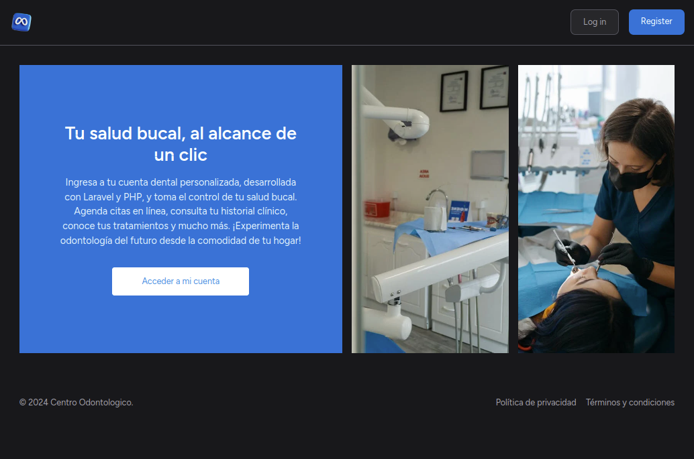
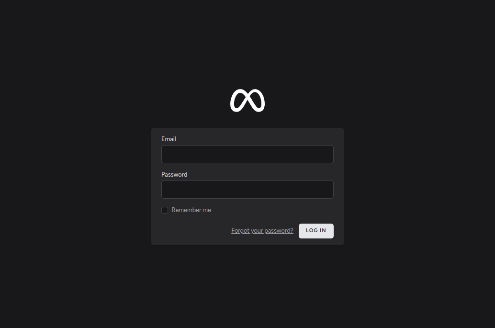
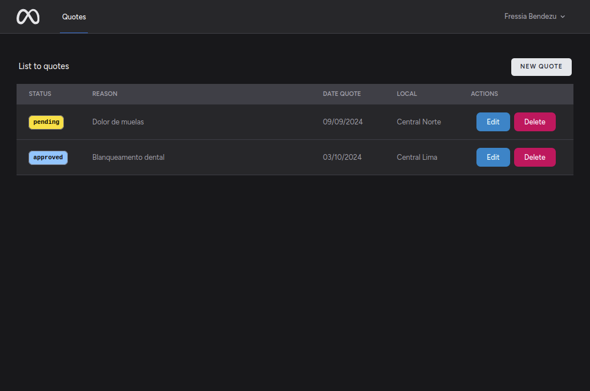
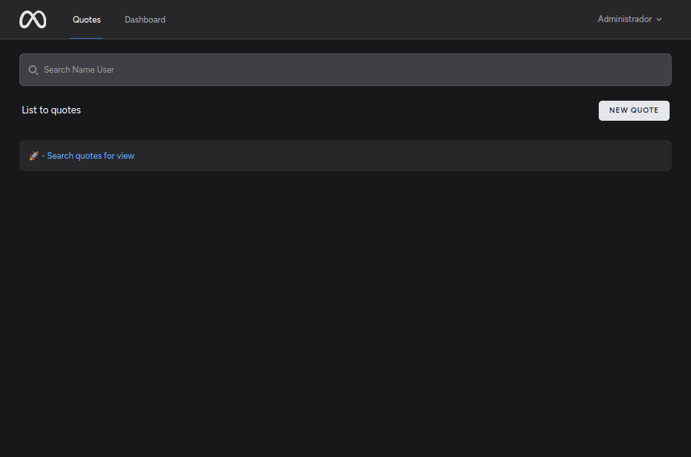
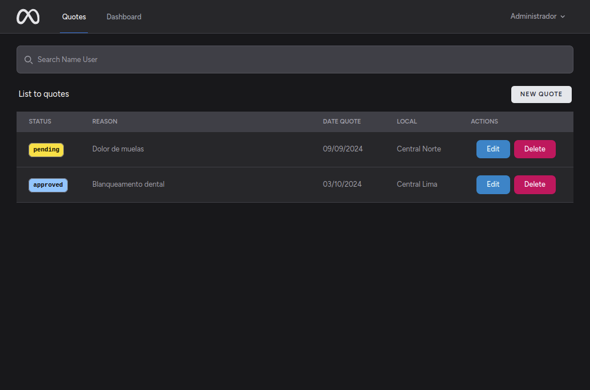
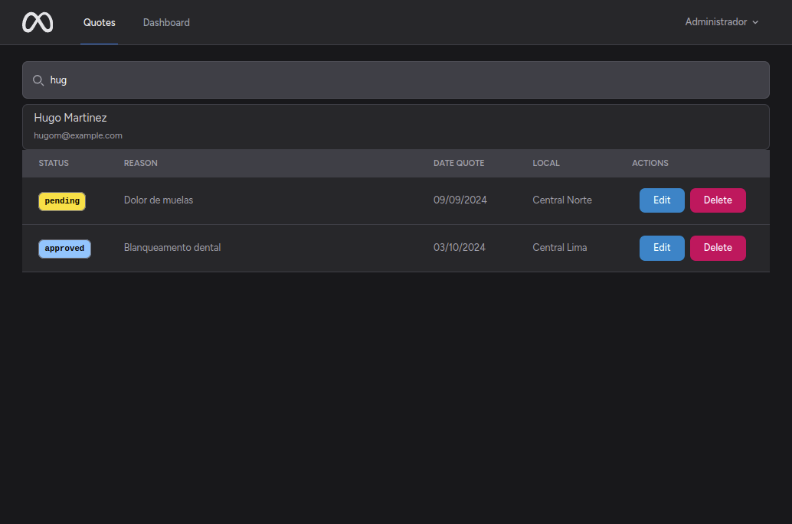
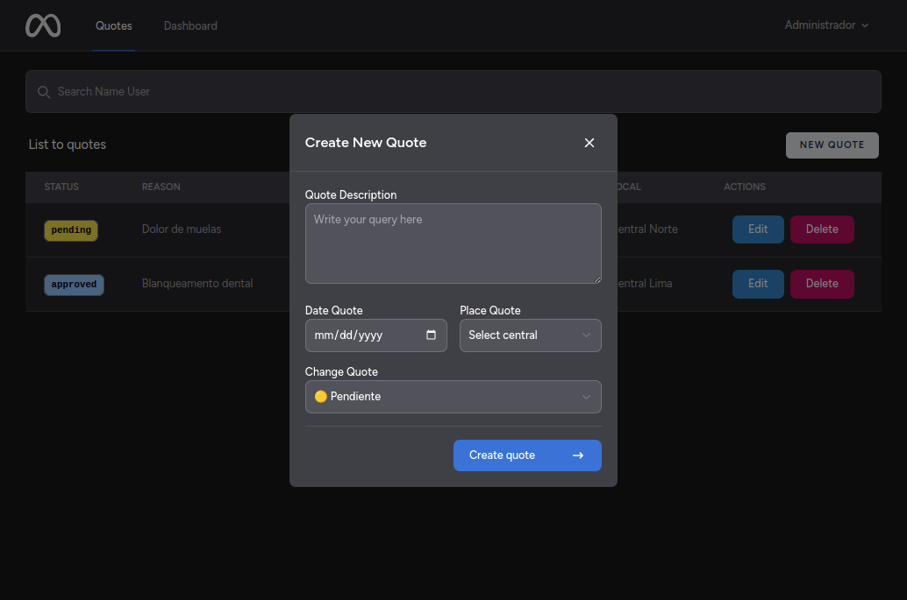
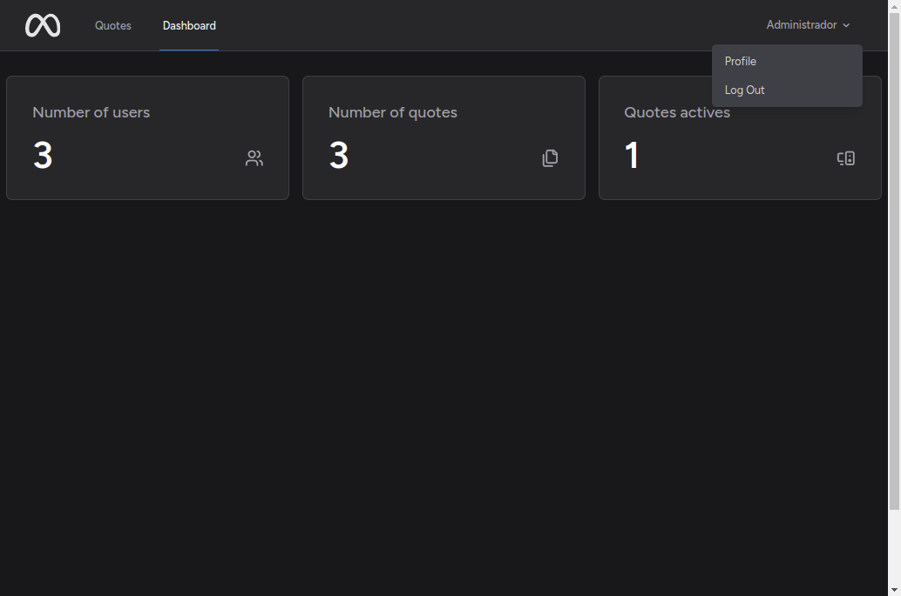

```sh
 .+"+.+"+.+"+.+"+.+"+.+"+.+"+.+"+.+"+.+"+.+"+.+"+.+"+.+"+.+"+.+"+. 
(      ___      _             _        ____              _        )
 )    / _ \  __| | ___  _ __ | |_ ___ | __ )  ___   ___ | |_     ( 
(    | | | |/ _` |/ _ \| '_ \| __/ _ \|  _ \ / _ \ / _ \| __|     )
 )   | |_| | (_| | (_) | | | | || (_) | |_) | (_) | (_) | |_     ( 
(     \___/ \__,_|\___/|_| |_|\__\___/|____/ \___/ \___/ \__|     )
(                                                                 )
 "+.+"+.+"+.+"+.+"+.+"+.+"+.+"+.+"+.+"+.+"+.+"+.+"+.+"+.+"+.+"+.+" 
```
> Este es un proyecto que inicialmente buscaba poner en práctica lo aprendido a nivel de Java con Spring Boot. Finalmente decidi migrar la idea del proyecto a PHP con Laravel y Livewire.

## About

Este proyecto busca simular un sistema de citas para un centro odontologico, donde un usuario podra agendar citas. Mientras un "operador" podra confirmar y administrar las citas.

## Screenshots

>Pagina Inicial



>Pagina de Login



>Vista de un usuario



>Vista de un admin



>Admin puede buscar y ver las citas de un Usuario




>Form para agregar/editar citas



>Dashboard


## Deployment

To deploy this project run

1. Install vite for hotreload in the web
```bash
pnpm install
```

2. Create database
```bash
php artisan migrate
```

3. Start server
```bash
php artisan serve
```

## Authors

- [@withoutnicks](https://www.github.com/withoutnicks)

## License

The Laravel framework is open-sourced software licensed under the [MIT license](https://opensource.org/licenses/MIT).
